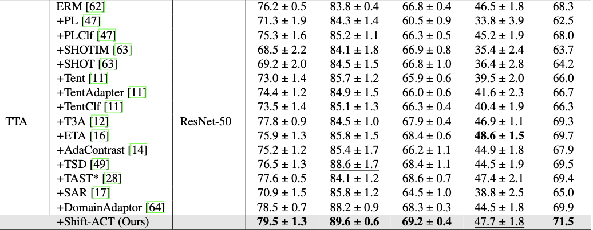

# SATA: Style Agnostic Test time Adaptation for Domain Generalization (IMAVIS _ 2025)

PyTorch implementation of (SATA: Style Agnostic Test time Adaptation for Domain Generalization)

Saeed Karimi, Hamdi Dibeklioglu


Note that this project is built upon [DomainBed@3fe9d7](https://github.com/facebookresearch/DomainBed/tree/3fe9d7bb4bc14777a42b3a9be8dd887e709ec414)

## Preparation

### Datasets

```sh
python -m domainbed.scripts.download --data_dir=/my/datasets/path
```

### Environments

Environment details used for our study.

```
Python: 3.8.6
PyTorch: 2.4.1
Torchvision: 0.19.1
CUDA: 12.6
NumPy: 1.26.4
```

## How to Run

`train_all.py` script conducts multiple leave-one-out cross-validations for all target domain.

```sh
python train_all.py exp_name --dataset PACS --data_dir /my/datasets/path
```

Example results:

```
+------------+--------------+---------+---------+---------+---------+
| Selection  | art_painting | cartoon |  photo  |  sketch |   Avg.  |
+------------+--------------+---------+---------+---------+---------+
|   ERM      |   85.7%      | 77.1%   | 97.4%   | 76.6%   | 84.2%   |
|   SATA     |   88.5%      | 84.8%   | 96.4%   | 84.2%   | 88.5%   |
+------------+--------------+---------+---------+---------+---------+
```

### Reproduce the results of the paper

We provide the instructions to reproduce the main results of the paper, Table 1.
Note that the difference in a detailed environment or uncontrolled randomness may bring a little different result from the paper.

- PACS

```
python train_all.py PACS0 --dataset PACS  --trial_seed 0  --data_dir /my/datasets/path
python train_all.py PACS1 --dataset PACS  --trial_seed 1  --data_dir /my/datasets/path
python train_all.py PACS2 --dataset PACS  --trial_seed 2  --data_dir /my/datasets/path
```

- VLCS

```
python train_all.py VLCS0 --dataset VLCS  --trial_seed 0  --data_dir /my/datasets/path
python train_all.py VLCS1 --dataset VLCS  --trial_seed 1  --data_dir /my/datasets/path
python train_all.py VLCS2 --dataset VLCS  --trial_seed 2  --data_dir /my/datasets/path
```

- OfficeHome

```
python train_all.py OH0 --dataset OfficeHome --trial_seed 0  --data_dir /my/datasets/path
python train_all.py OH1 --dataset OfficeHome --trial_seed 1  --data_dir /my/datasets/path
python train_all.py OH2 --dataset OfficeHome --trial_seed 2  --data_dir /my/datasets/path
```

- TerraIncognita

```
python train_all.py TR0 --dataset TerraIncognita --trial_seed 0 --data_dir /my/datasets/path
python train_all.py TR1 --dataset TerraIncognita --trial_seed 1  --data_dir /my/datasets/path
python train_all.py TR2 --dataset TerraIncognita --trial_seed 2  --data_dir /my/datasets/path
```

## Main Results




## Citation
